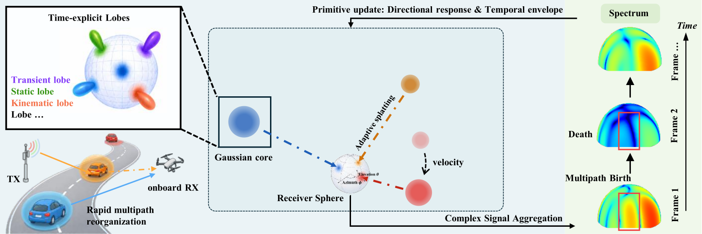
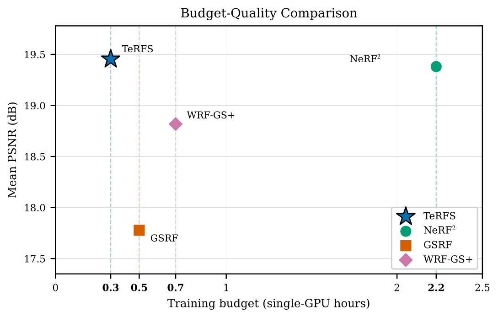
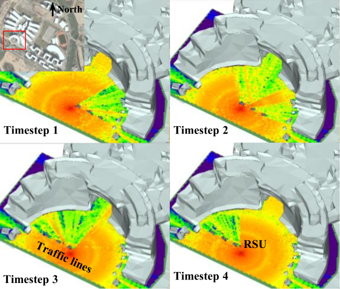

# TeRFS: Temporal-Evolving Radio Field Synthesis

[](https://arxiv.org/abs/2605.02359)

TeRFS lifts radio-field synthesis from static scenes to **spatio-temporal** reconstruction. Per-lobe Gaussian temporal envelopes on an **anisotropic spherical Gaussian (ASG) directional basis** give every multipath component an explicit, differentiable **birth-and-death mechanism**; paths emerge, evolve, and vanish at precise timestamps as scatterers move.

<p align="center">
  
</p>

## Highlights

- **Single-frame spatial synthesis**: 19.45 dB mean PSNR; −11.5 % MSE vs NeRF², 6.9× faster training (0.32 h on a single RTX 4090).
- **Temporal interpolation**: 1.52 dB median / 2.53 dB mean absolute RSS error across 60,240 unseen spatio-temporal samples.
- **Open source dataset**: 100 frames, 5.9 GHz RSU, moving objects trigger drastic multipath reorganization.

<p align="center">
  
</p>

## Datasets

[](https://drive.google.com/drive/folders/1G9dFRymwJnvbfXiSDdBTYMbHULL88B81?usp=sharing)

**TeRFS-Campus-5.9GHz** lifts RF radiance-field benchmarking from static snapshots into the temporal domain.

<div align="center">


|            | NeRF²                 | **TeRFS**                   |
| ------------ | ------------------------ | ----------------------------- |
| Setting    | Single static snapshot | 100 frames, 10 s sequence   |
| Scatterers | All stationary         | 6 cars + 1 drone, in motion |
| Scene      | Small indoor           | Urban outdoor               |

</div>

**Dataset snapshots**

<p align="center">
  
</p>
<p align="center"><sub>Four timesteps: passing vehicles trigger drastic multipath reorganization around the RSU.</sub></p>

## Code

The code will be released after acceptance.

## Citation

```bibtex
@article{zhang2026terfs,
  title   = {{TeRFS}: Temporal-Evolving Radio Field Synthesis},
  author  = {Zhang, Pengyang and Lu, Wenlihan and Gao, Shijian},
  journal = {arXiv preprint arXiv:2605.02359},
  year    = {2026}
}
```
