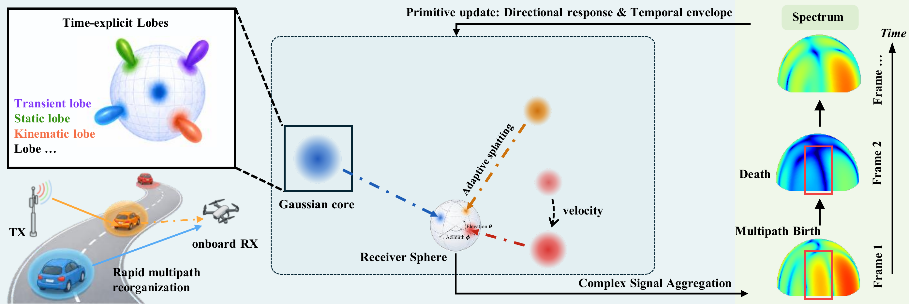
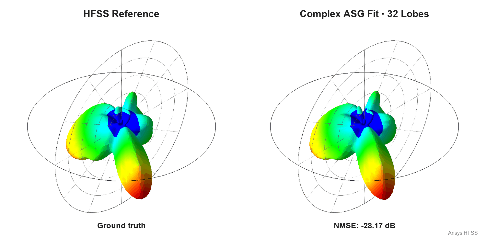
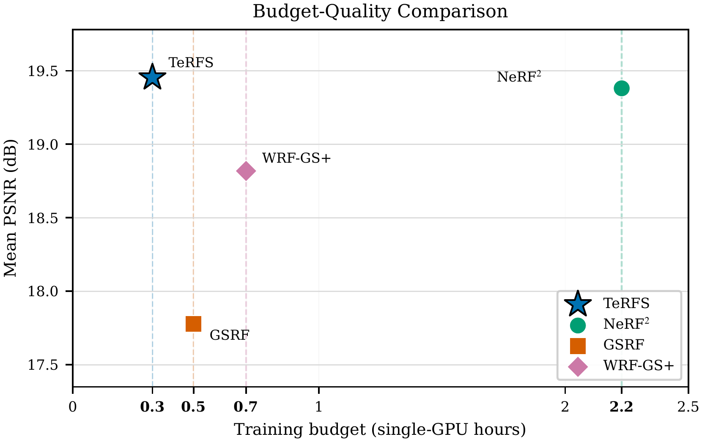
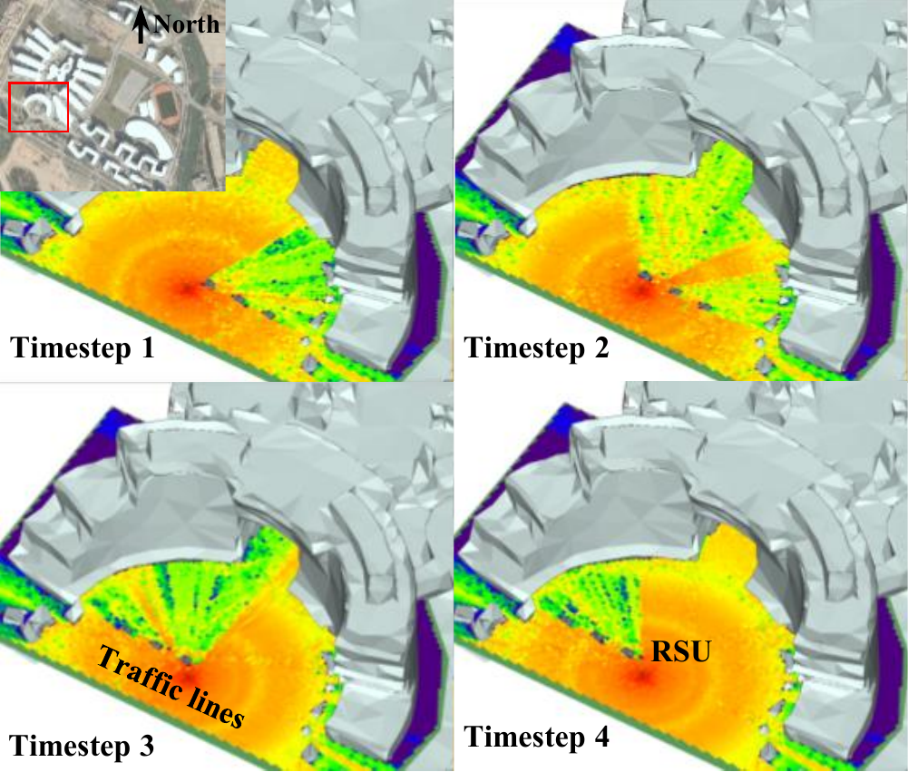

<h1 align="center">TeRFS: Temporal-Evolving Radio Field Synthesis</h1>

<h3 align="center">IEEE GLOBECOM 2026</h3>

<p align="center">
  Pengyang Zhang, Wenlihan Lu, Shijian Gao<br/>
  The Hong Kong University of Science and Technology (Guangzhou)
</p>

<p align="center">
  <a href="https://arxiv.org/abs/2605.02359">Paper</a> ·
  <a href="https://drive.google.com/drive/folders/1G9dFRymwJnvbfXiSDdBTYMbHULL88B81?usp=sharing">Dataset</a> ·
  <a href="#code">Code</a> ·
  <a href="#citation">Citation</a>
</p>

TeRFS extends radio-field synthesis from static scenes to **spatio-temporal reconstruction**. It couples an **anisotropic spherical Gaussian (ASG) directional basis** for sharp angular structure with **per-lobe Gaussian temporal envelopes** for path lifecycles. This design supports an explicit **birth-and-death mechanism** to capture multipath reorganization as moving scatterers create and block propagation paths.

<p align="center">
  
</p>

<p align="center">
  <em>In dynamic scenes, TeRFS represents the propagation environment, models how multipath components evolve over time, and synthesizes the angular spectrum at each receiver, capturing radio-field changes induced by moving scatterers. This provides a foundation for environment-aware wireless applications under high mobility.</em>
</p>

### ASG Representation

Motivated by the **sparse, directional structure of RF multipath**, TeRFS adopts ASG to represent sharp angular peaks that spherical harmonics (SH) tend to smooth out.

<p align="center">
  
</p>
<p align="center">
  <em>Expressive capacity of the ASG basis, illustrated by fitting HFSS far-field patterns.</em>
</p>

TeRFS builds on this directional expressiveness with per-lobe temporal envelopes, enabling **explicit modeling of multipath birth and death**.

### Results

Evaluated on TeRFS-Dynamic using a single RTX 4090.

<div align="center">
<table align="center">
  <thead>
    <tr><th align="center">Evaluation</th><th align="center">Key result</th></tr>
  </thead>
  <tbody>
    <tr><td align="center"><strong>Temporal interpolation</strong></td><td align="center"><strong>75%</strong> of test samples have absolute RSS error <strong>≤ 3.26 dB</strong></td></tr>
    <tr><td align="center">Spatial synthesis</td><td align="center"><strong>11.5% lower mean MSE</strong> than NeRF²</td></tr>
    <tr><td align="center">Training efficiency</td><td align="center"><strong>6.9× faster training</strong> than NeRF²</td></tr>
    <tr><td align="center">Representation efficiency</td><td align="center"><strong>63.1% fewer primitives</strong> than explicit baselines</td></tr>
  </tbody>
</table>
</div>

<p align="center">
  
</p>

<p align="center">
  <em>Reconstruction quality versus training time under default training schedules.</em>
</p>

### Dataset

The **TeRFS-Dynamic** dataset captures radio-field evolution in a simulated outdoor campus, where multiple vehicles and a UAV create and block propagation paths.

[Download Dataset](https://drive.google.com/drive/folders/1G9dFRymwJnvbfXiSDdBTYMbHULL88B81?usp=sharing)

<div align="center">
<table align="center">
  <thead>
    <tr><th align="center"></th><th align="center"><a href="https://github.com/XPengZhao/NeRF2">NeRF²</a></th><th align="center">TeRFS-Dynamic</th></tr>
  </thead>
  <tbody>
    <tr><td align="center">Setting</td><td align="center">Static scenes</td><td align="center"><strong>Dynamic temporal sequence</strong></td></tr>
    <tr><td align="center">Scatterers</td><td align="center">Stationary</td><td align="center"><strong>Moving vehicles and UAV</strong></td></tr>
    <tr><td align="center">Scene</td><td align="center">Indoor / semi-indoor</td><td align="center"><strong>Outdoor campus</strong></td></tr>
  </tbody>
</table>
</div>

<p align="center">
  
</p>

<p align="center">
  <em>Four timesteps showing multipath reorganization as vehicles pass near the roadside transmitter.</em>
</p>

### Code

Code release coming soon.

### Citation

If you find TeRFS or its dataset useful, please cite:

```bibtex
@article{zhang2026terfs,
  title   = {{TeRFS}: Temporal-Evolving Radio Field Synthesis},
  author  = {Zhang, Pengyang and Lu, Wenlihan and Gao, Shijian},
  journal = {arXiv preprint arXiv:2605.02359},
  year    = {2026}
}
```

### Contact

Pengyang Zhang · [zgotohdx@outlook.com](mailto:zgotohdx@outlook.com)
